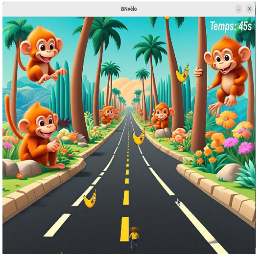

 # 🚴‍♂️ Jeu de Course à Vélo - SDL2

[](https://isocpp.org/)
[](https://www.libsdl.org/)
[](LICENSE)

Un jeu de course à vélo développé en **C++** avec la bibliothèque graphique **SDL2**. Le joueur contrôle un vélo et doit éviter des obstacles (murs) tout en terminant la course dans un temps limité.

## 🎮 Aperçu

 

<div align="center">
  
  <br/>
  <em>Figure  : Gameplay en action</em>
</div>

## 📋 Fonctionnalités

- ✅ Menu principal interactif (Démarrer, Règles, Quitter)
- ✅ Déplacement du vélo avec les touches directionnelles (haut, bas, gauche, droite)
- ✅ Obstacles dynamiques (murs) qui défilent à l'écran
- ✅ Détection précise des collisions
- ✅ Chronomètre avec compte à rebours
- ✅ Écran "À propos" informatif
- ✅ Gestion complète des événements SDL2 (clavier, fermeture fenêtre)
- ✅ Interface fluide et responsive

## 🧱 Structure du projet

Le projet suit une architecture orientée objet avec les classes suivantes :

| Classe | Rôle |
|--------|------|
| `Velo` | Gère le vélo du joueur (position, déplacement, affichage) |
| `Mur` | Représente les obstacles (position, défilement, collision) |
| `Jeux` | Noyau principal : initialisation, boucle de jeu, événements |
| `Menu` | Affiche et gère le menu principal |
| `APropos` | Affiche les informations sur le projet |
| `Chronometre` | Gère le compte à rebours et le temps restant |

## 🛠️ Technologies utilisées

- **C++17** – Langage de programmation
- **SDL2** – Gestion graphique et événements
- **SDL2_image** – Chargement des images (PNG, JPG)
- **SDL2_ttf** – Affichage de texte
- **draw.io** – Conception des diagrammes UML
- **remove.bg** – Suppression d'arrière-plan des textures

## 📦 Installation et compilation

### Prérequis

Assurez-vous d'avoir installé les bibliothèques SDL2 nécessaires :

#### Sur Ubuntu/Debian
```bash
sudo apt-get install libsdl2-dev libsdl2-image-dev libsdl2-ttf-dev
